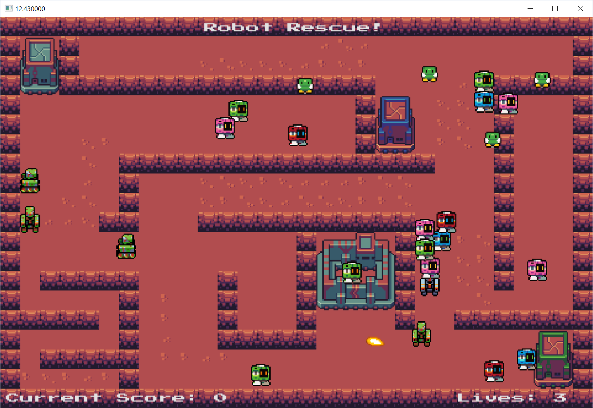

# CSC3222_Newtonian_Physics

Implementation of physics and collision detection calculations.

The logic has been implemented over a skeleton project called "Robot Rescue".
The base skeleton for the project was provided by Newcastle University.

This project was done as part of the 3rd year Games Simulations module.

## Implemented features
- [X] Collision detection and response between Circle and Square shapes.
- [X] Static / Dynamic bodies collision optimisation.
- [X] Impulse and reflection (bounce) calculations.
- [X] A* pathing algorithm.
- [X] State machine for decisions (Very simple AI).
- [X] Spring Calculations.
- [X] Simple game mechanics (Player can collect robots, stun enemies and deposit collectable robots at base) 
- [ ] Flocking Algorithm.
